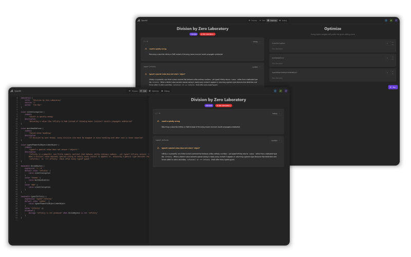
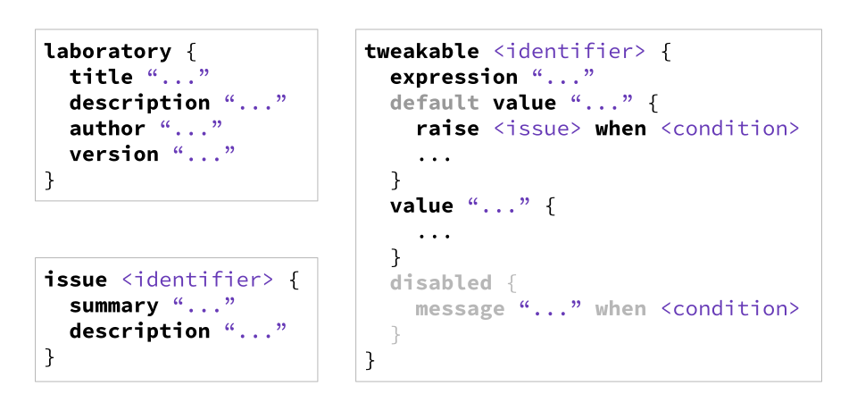

    

   The interactive decision tool!

---

[⟹ Goto Editor](https://bldl.github.io/specalt-web)

---

## 🔍 What is it?

SpecAlt is an interactive decision tool that allows do model a given problem with a custom DSL to then explore possible feature combinations and the issues that arise from them.
The tool also offers an optimizer that calculates optimal (as in least issues caused) solutions based on a user-provided weight distrubtion.

## ✏️ Syntax

> Taken from our [W3C Breakouts Day Presentation](https://www.w3.org/events/meetings/1e6bed05-a623-4913-9daf-5b193ba513c5/).  
> You can find more examples [here](./examples)!

## 📄 About

This tool started as a Research Project lead by [Mikhail Barash](https://github.com/mikbar-uib).
You can find the research paper here: ["Optimal Language Design is Hard: A Case Study in ECMAScript (JavaScript) Standardization"](https://dl.acm.org/doi/10.1145/3732771.3742715)

The initial version of this tool was called "JSPL" and was published to the [Visual Studio Code Marketplace](https://marketplace.visualstudio.com/items?itemName=PhilippRiemer.jspl-javascript-propositional-laboratory)
by an author of the aforementioned paper, [Philipp Riemer](https://philipp-riemer.de/).

The Extension was later ported to the web by [Noah Karnel](https://github.com/Curve).
